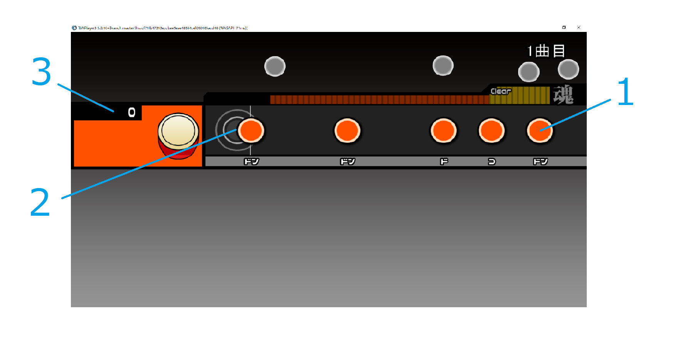

# 実験説明書

## 実験の目的・内容

この実験は横スクロール型リズムゲームを多数の被験者にプレイしてもらい、そのプレイ内容および成績を集計することを目的としています。

リズムゲーム「太鼓の達人」を模したオープンソースソフトウェア(MIT license)の「OpenTaiko」を用いてリズムゲームをプレイしていただきます。

## 実験の手順

### 1. 実験環境のダウンロード

このページ右上にある「Code」プルダウン内の「Download ZIP」でこのリポジトリをダウンロードする。(または、このリポジトリをクローンする。)

### 2. OpenTaikoの起動

ダウンロードしたzipファイルを任意の場所に解凍したのち、OpenTaiko.exeを実行する。

もしセキュリティ上の通知が表示されても問題ないので無視して実行してください。

### 3. OpenTaikoの操作 -選曲まで-

#### 操作方法(メニュー画面)

* 矢印左右キー: 選択
* enter: 決定
* esc: 戻る

(J, F, K, Dキーを用いて操作する事も出来ますが、ここでは集計に用いるプログラムの都合上**使用しないで**ください)

#### 操作手順

1. enterキーを押す。

2. Pキーを長押しする。

3. "Left", "Right"好きな方を選択する。

4. "演奏ゲーム"を選択する。(これ以降も全て矢印キーの**左右で**選択できます。上下キーで操作は出来ません。)

5. "Classical"を選択する。

6. "天国と地獄 序曲"を選択する。

### 4. 実プレイ

#### ゲーム内容の説明

ゲーム「太鼓の達人」を知っている人向けの説明（クリックで開けます）

「太鼓の達人」を模したゲームをプレイしていただきます。

* 曲は「天国と地獄 序曲」です。運動会で流れてそうなあの曲です。
* 難易度は「Normal」（ふつう）です。
* **なるべく高いスコアが得られるようにプレイしてください。**
* コンボ数は獲得できるスコアに影響しません。（いわゆる真打モード）
* タイミングの判定は"Good">"Ok">"Bad"（いわゆる"良">"可">"不可"）の順で、より良い判定の方が高いスコアが得られます。ただし、"Bad"で得られるスコアは0です。
* 大音符は**片手で叩くだけ**で通常の音符より多くのスコアが獲得できます。
* 連打もスコアに影響します。ですので、なるべく無視せず叩いてください。

ゲーム「太鼓の達人」を知らない人向けの説明（クリックで開けます）

曲とともに流れてくる音符に合わせて太鼓を叩くリズムゲームをプレイしていただきます。

##### 画面の説明

1. 音符
プレイヤーがタイミングを合わせて叩く音符。いくつか種類があり、それぞれ叩き方が異なる。（後述）
2. 判定枠
この枠の中心に音符が重なった瞬間に太鼓を叩く。
3. 現在の獲得スコア
タイミングよく音符を処理することで得られるスコアの合計値が表示される。

##### 音符の種類

#### 操作方法

* F, Jキー: 面を叩く（ドン）
* D, Kキー: 縁（ふち）を叩く（カッ）
